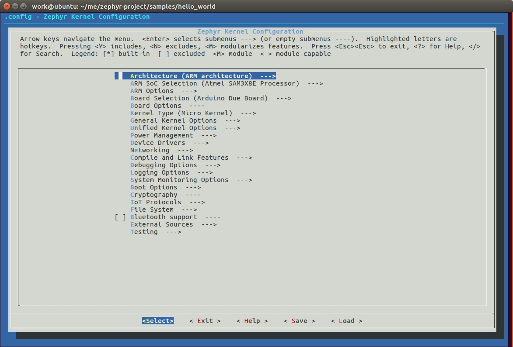
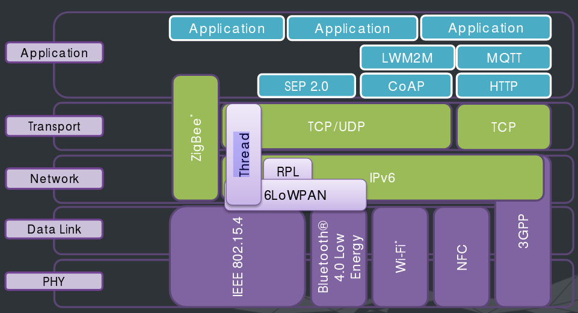

.. _preface:

翻译前言
****************

.. contents::
    :local:
    :depth: 2

Zephyr 是什么
#####################

Zephyr 是什么？它是 Linux 的孪生兄弟，也是一个操作系统。更准确地说，它是一个专用于资源受限的 IoT 领域的操作系统。

Linux 基金会于 2016 年 2 月发布了 Zephyr 项目，希望借助它来统一物联网领域的混乱局面，以推进物联网领域的快速发展。

Zephyr 有啥优势
#####################

轻量级
---------------------

由于 IoT 领域需要部署大量的联网设备，因此每个设备的成本必须得到控制。控制成本第一个有效方法是降低昂贵组件的标准，例如使用 RAM 更低、ROM 更低的芯片。Zephyr 就是专为这样的芯片而生的，它可运行在只有 8 Kb 内存的 MCU 之上，甚至能在只有 2 Kb 内存的 MCU 上演示 Hello World。

高度可配置
---------------------
降低成本的另一个方式是按需裁剪硬件。物联网设备一般都是专用设备，因此在面对某个特定市场时只需要特定的硬件。 Zephyr 借鉴了 Linux 的 Kconfig 配置系统，您可以根据硬件设备对它进行直观的配置、裁剪。配置界面如下：

多架构
---------------------

.. highlight:: console
   :linenothreshold: 1

Zephyr 在被设计时就支持多架构，包括 x86、ARM 和 ARC（DSP 内核）。到 v1.6.0 时，Zephyr 已支持非常多的开发板： ::

  work@ubuntu:~/me/zephyr-project/boards$ tree -L 2
  .
  ├── arc
  │   ├── arduino_101_sss
  │   ├── em_starterkit
  │   └── quark_se_c1000_ss_devboard
  ├── arm
  │   ├── 96b_carbon
  │   ├── 96b_nitrogen
  │   ├── arduino_101_ble
  │   ├── arduino_due
  │   ├── bbc_microbit
  │   ├── cc3200_launchxl
  │   ├── frdm_k64f
  │   ├── hexiwear_k64
  │   ├── my_stm32
  │   ├── nrf51_blenano
  │   ├── nrf51_pca10028
  │   ├── nrf52_pca10040
  │   ├── nucleo_f103rb
  │   ├── nucleo_f401re
  │   ├── olimexino_stm32
  │   ├── qemu_cortex_m3
  │   ├── quark_se_c1000_ble
  │   ├── stm32_mini_a15
  │   └── v2m_beetle
  ├── Kconfig
  ├── Makefile
  ├── nios2
  │   ├── altera_max10
  │   └── qemu_nios2
  └── x86
      ├── arduino_101
      ├── galileo
      ├── minnowboard
      ├── qemu_x86
      ├── quark_d2000_crb
      └── quark_se_c1000_devboard

可移植性
---------------------
Zephyr 的可移植性非常强，几个月的时间，它所支持的开发板的数量已经由不足十块到上面所列举的三十多块了。就连我这种小菜鸟都能将 Zephyr 移植到自己的 CC2538 上面（其实只是系统能跑起来，串口能打印而已，参考 `这里 <https://github.com/tidyjiang8/zephyr-os>`_ 的两个 commints `Init support for ti cc2538  <https://github.com/tidyjiang8/zephyr-os/commit/94694a6c505ccddc171bdca58181d27c376f3c05>`_ 和 `cc2538 串口 poll ok  <https://github.com/tidyjiang8/zephyr-os/commit/ffa1a5888674cb41a78aace766b51a1917e1df9a>`_ ）。

为啥移植性这么强？因为 Zephyr 在被设计时就考虑了可移植性，用户只需要添加少量与开发板相关的代码就能跑起来了。

丰富的物联网协议
---------------------

物联网一直在发展，存在的协议也多种多样，而且将来肯定还会有新的协议诞生，我们很难说哪个协议最终会脱颖而出，因为它们各自有自己的应用领域。因此，Zephyr 会尽可能多地包括这些协议。来看看 Zephyr 支持（以及今后会支持）哪些物联网协议：

Zephyr 包括这么多协议会不会太臃肿？这不是与它所说的轻量级自相矛盾吗？答案是不会！我们前面已经说了，Zephyr 是高度可配置的，应用开发者可以根据自己项目的需要，只把相关的功能编译到镜像文件中，从而避免臃肿。

丰富的设备驱动
---------------------
Zephyr 同样还支持丰富的设备驱动程序： ::

  work@ubuntu:~/me/zephyr-project/drivers$ tree -L 1
  .
  ├── adc
  ├── aio
  ├── bluetooth
  ├── clock_control
  ├── console
  ├── counter
  ├── dma
  ├── ethernet
  ├── flash
  ├── gpio
  ├── grove
  ├── i2c
  ├── ieee802154
  ├── interrupt_controller
  ├── ipm
  ├── Kconfig
  ├── Makefile
  ├── pci
  ├── pinmux
  ├── pwm
  ├── random
  ├── rtc
  ├── sensor
  ├── serial
  ├── shared_irq
  ├── spi
  ├── timer
  ├── usb
  └── watchdog

电源管理
---------------------
很多物联网设备都是用纽扣电池供电的，经常更换电池的成本是非常高的。当然，这里说的高并非电池本身昂贵，而是指更换电池时的人力成本。要想一颗小小的纽扣电池运行数年可不是一件简单的事儿，Zephyr 早已考虑到了这一点，它提供了一个电源管理子系统，管理外设的功耗，以达到省电的目的。此外，该功能也是可裁剪的，如果您的设备没有低功耗要求，可以将其裁剪掉。

Shell 支持
---------------------
想要查看设备内部的运行情况？Zephyr 提供了一个 shell 接口，您可以将您的应用程序的部分接口暴露给 shell，这样您就能与设备进行人机交互了。当然，更高大上的做法是使用 APP 控制设备，直接在 APP 上与设备进行交互，不过这样的开发成本会增加很多。此外，该功能也是可裁剪的，您可以在开发测试阶段使用该功能，正式投入产品后将其裁剪掉。

C++ 支持
---------------------
您没看错，Zephyr 支持 C++。当然，这里的支持并不是完全支持，只是支持部分特性，例如 C++ 仅支持虚函数、继承等一些基本功能。

其实，Zephyr 还支持 JavaScript。那岂不是运行速率极慢？No！No！No！运行确实比 C 慢，但是却不会慢太多！Zephyr 中的 JavaScript 是利用的三星的另一个开源项目 JerryScript 作为解释器的。JerryScript 是一个专门用于物联网领域的 JavaScript 解释器，它对很多细节做了优化，直接将 jS 脚本文件编译到二进制进行文件中，并非像传统的 js 那样解释执行。

活跃的开发者
---------------------
Zephyr 受到几大厂商/基金会的支持，包括 Linux 基金会、Linaro 组织（成员包括 ARM、飞思卡尔、IBM、三星、ST、TI、华为海思等）、Intel、NXP、新思科技等，开发者众多。

如果您加入了 Zephyr 的邮件列表，或者您注册了 Linux 基金会的账户并登录了 Zephyr 的 JIRA，您可以看到 Zephyr 的开发非常活跃。Zephyr 平均每三个月就会发布一个新版本，而每次新版本的发布都会增加新的功能。例如 v1.6.0 的发布对内核部分做了非常大的改动。预计到 v1.7.0 时，Zephyr 会对协议栈部分做非常大的改动。如此活跃的开发，我们仿佛可以看到 Zephyr 的未来。

为啥学习 Zephyr
#####################
当然，前面说了那么多都是空谈，Zephyr 究竟会不会引领物联网市场呢？您猜！

未来的事儿我咋知道呢！不过技多不压身，成为强者后还怕没饭碗？君不见阿里前段时间在招聘 OS 相关人才时还专门列出“熟悉 Zephyr 优先”，君不见 ARM 的招聘岗位中也写者“Family with Zephyr is a plus”，君不见谷歌上海当前正在招聘 `嵌入式无线协议栈工程师 <https://www.linkedin.com/jobs/view/214747293/?trk=jobs_biz_prem_srch>`_ （其实就是这些协议栈中的内容），君不见百度、华为、思科、Intel 都在招聘相关人才吗。站在学习者的角度，能从 Zephyr 中学习到这些东西：

- 基本内功：

  * C
  * 汇编
  * 数据结构

- 操作系统/内核： Zephyr 中关于内核这一块可谓是经典。
  
  * 线程
  * 上下文
  * ISR
  * FIFO、LIFO
  * 栈
  * 时钟、定时器
  * 信号量、互斥量
  * 管道
  * 消息队列
  * 内存分配管理
  * ...

- 设备驱动：您能想到的设备都有。

  * USB
  * BLE
  * DMA
  * Flash
  * RTC
  * Sensor
  * watchdog
  * I2C、UART、SPI
  * ...

- 协议栈：大量物联网相关的协议

  * 6LoWPAN
  * CoAP
  * RPL
  * MQTT
  * IEEE 802.15.4
  * 低功耗蓝牙
  * IPv4/IPv6
  * ...

- 文件系统
- **架构能力，分析大型软件的能力**

中文文档翻译计划
#####################
虽然 Zephyr 是一个好的操作系统，虽然它的文档写得非常细致、全面，但是架不住它的文档是英文的呀，一下子就能浇灭很多初学者的热情。鉴于此，所以决定在 v1.6.0 发布之后将其文档翻译成中文，以供广大爱好者学习提供一点帮助。

从本月月初 Zephyr 发布 v1.6.0 到现在，差不多快有一个月的时间，除代码里的 API 注释之外，已经基本上将整个文档翻译完了。在整个翻译过程中，几乎把所有工作都扔到一边去了，没有周末，没有假期，每天晚上十二点后睡觉，虽然非常辛苦，但是看着翻译进度条一点一点前进，还是蛮欣慰的。此外，`ianhom <https://github.com/ianhom>`_ 也热心地分担了部分章节，非常感谢。

**预计明年 2 月底 3 月初 Zephyr 会发布 v1.7.0，到时候会增加许多网络协议栈相关的文章，我仍然会继续将其翻译成中文，同时也号召更多的 Zephyr 爱好者参与进来，一起翻译，一起分担，一起学习**。

纠错
-----------------------
由于时间匆忙，任务量大，英语水平和专业水平有限，所以不可避免地会有很多错别字，或者错误的格式，或者甚至不通顺、不恰当的语句，如果您在阅读的过程中发现了这些缺陷，请指正出来。

纠错的途径：

- 直接在 `Github <https://github.com/tidyjiang8/zephyr-doc>`_ [1]_ 上 Frok 项目，修正，然后提交 PR。具体步骤请参考 `CONTRIBUTION.md <https://github.com/tidyjiang8/zephyr-doc/blob/v1.6.0/CONTRIBUTION.md>`_  [2]_ 。
- 到网页中的相应页面下面进行评论，我看到这些评论后会进行修改。不够由于网页的评论是集成第三方的，我不一定能及时看到。
- 进 QQ 群并指出。

广告
-----------------------
如果您觉得这个文档对您有所帮助，那就点击 `Github 仓库 <https://github.com/tidyjiang8/zephyr-doc>`_ 右上角的 Star 按钮收藏下吧，这也是我的动力之一。

.. [1] https://github.com/tidyjiang8/zephyr-doc

.. [2] https://github.com/tidyjiang8/zephyr-doc/blob/v1.6.0/CONTRIBUTION.md

